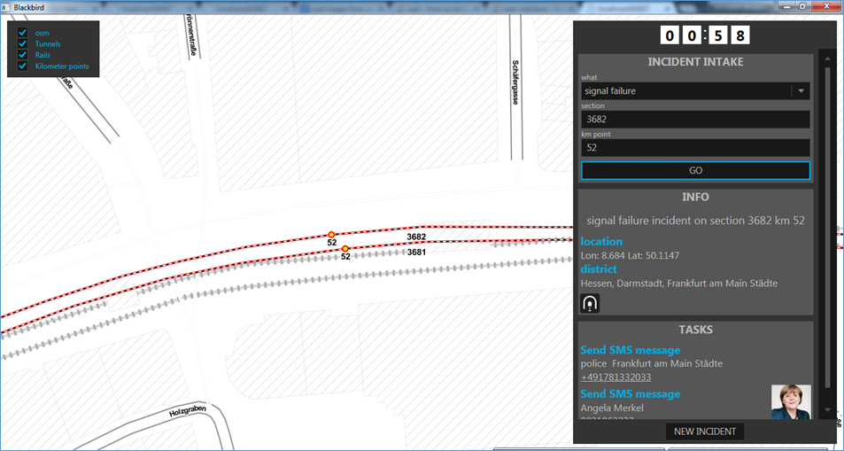
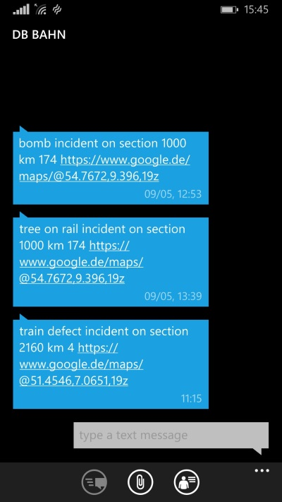

## Blackbird

Geodan Incident Management System build for dbhackathon2015 Berlin, may 2015

Blackbird is an incident management system for the incident control room. Blackbird is responsible for intake, visualization, 
analyse, reporting and notification of incidents. 
Based on intelligent spatial queries and the Blackbird Rule Based Engine notifications are send to 
responsible people in order to fix the incidents more quickly and reduce costs.

## Features:

- Intake incident based on Bahnstrecke and kilometer number;
- Visualization incident in map;
- Analyse incident: geocoding incident + regio detection + tunnel detection;
- Task analysis using Blackbird Rule Based Engine™;
- Send SMS notifications to responsible people. SMS contains basic incident information + Google Maps link
for navigation to incident. 

## Techniques

- UI: WPF with Mapsui mapping library;
- Services: ASP.NET Web API;
- Database: PostgreSQL + PostGIS extension;
- Server-side Mapping: Geoserver.

## Libraries
- Mapsui https://github.com/pauldendulk/Mapsui
- Dapper https://github.com/StackExchange/dapper-dot-net
- Npgsql https://github.com/npgsql/npgsql
- Web API https://github.com/aspnet

## Data used

- Kilometerpoints shape;
- Bahnstrecken shape;
- Tunnels shape;
- Regios shape;
- States shape.

Basemap: Toner Lite from Stamen
http://maps.stamen.com/toner-lite/#12/37.7706/-122.3782

## Presentation

https://github.com/Geodan/DBHackathon2015/blob/master/doc/Presentation%20team%20Geodan.pptx

## Blackbird Api

- HTTP GET api/geocode?railnumber=:railnumber&kmpoint=:kmpoint

returns latitude, longitude of incident

- HTTP GET /api/pinpoint?longitude=:longitude&latitude=:latitude

returns district information, is in tunnel and a list of tasks (send sms messages for now)

